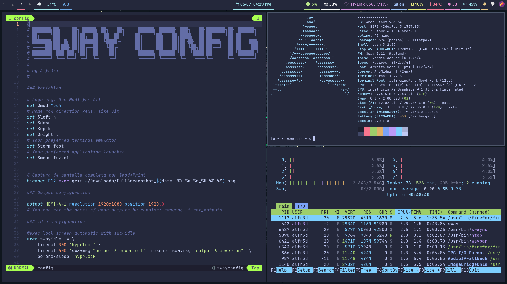

# ⭐ Dotfiles Sway ⭐

### These are elements of my configuration on Sway Compositor

# sway

# Install the following packages

- sway
- waybar
- foot
- fuzzel
- kitty
- pacman-contrib
- pipewire
- pipewire-pulse
- wireplumbler
- brightnessctl
- htop
- curl
- autotiling
- swww
- network-manager-applet
- xdg-desktop-portal
- xdg-desktop-portal-wlr
- hyprlock
- bat
- mako

# install packages of AUR

- waypaper
