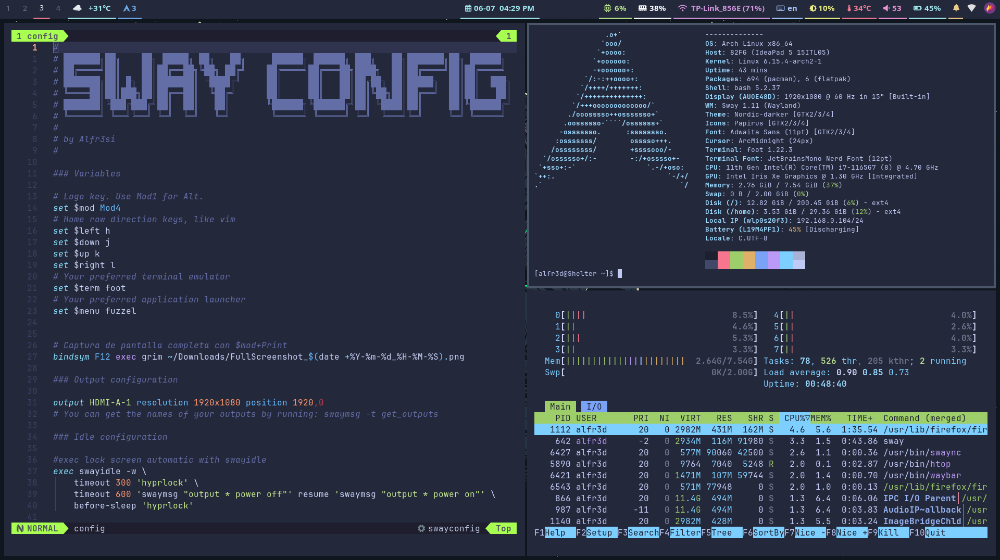
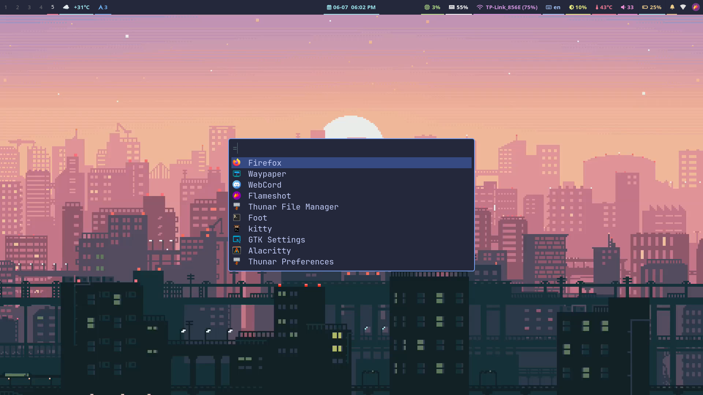
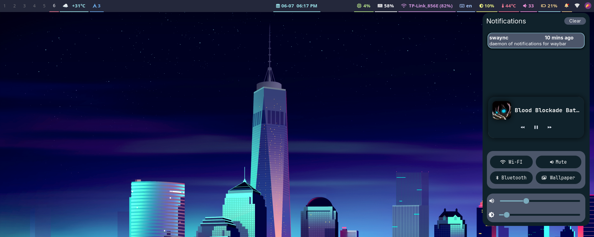
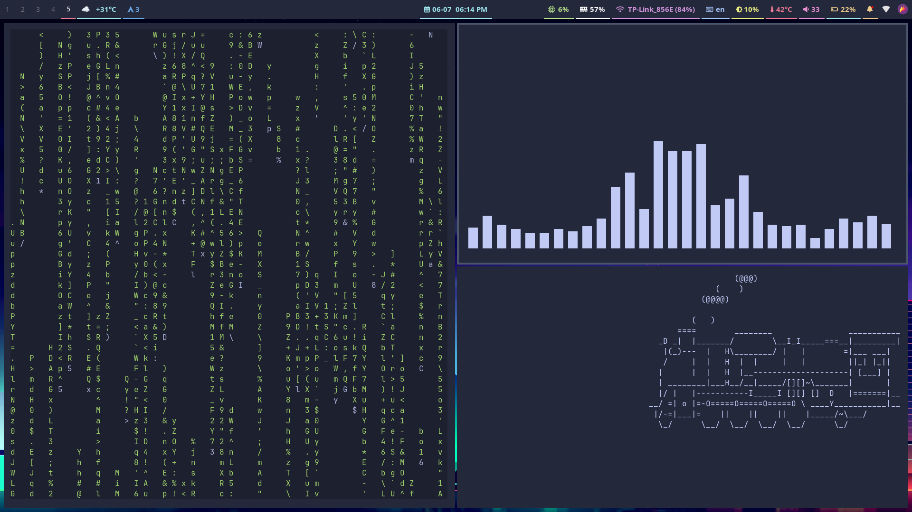
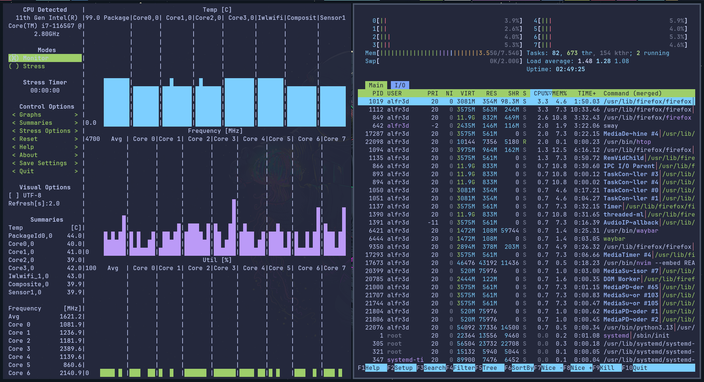
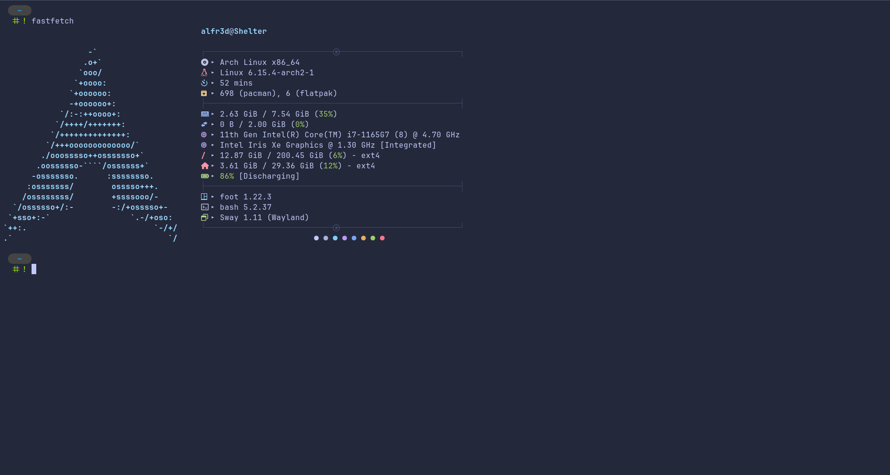

# ⭐ Dotfiles Sway ⭐

### These are elements of my configuration on Sway Compositor

# sway

#### The enviroment where the experience takes place

# fuzzel

#### Launcher of applications

# waybar and swaync

#### Both have been customized for my personal convenience

# foot

#### A lightweight terminal, perfect for sway

# Additional

## kitty

#### Alternative terminal for certain occasions

## fastfetch

#### A system information tool

